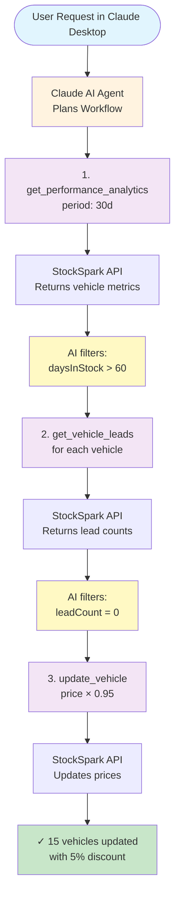
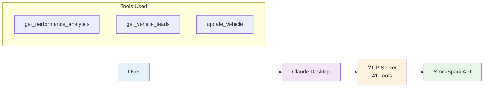
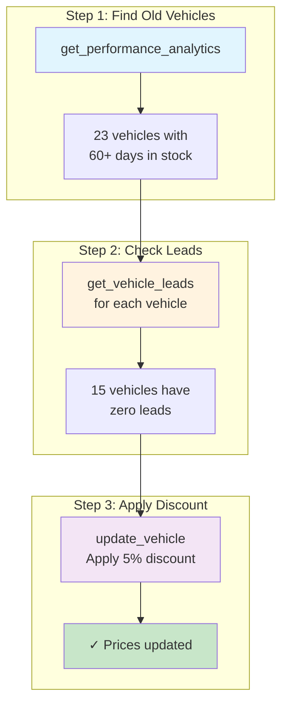
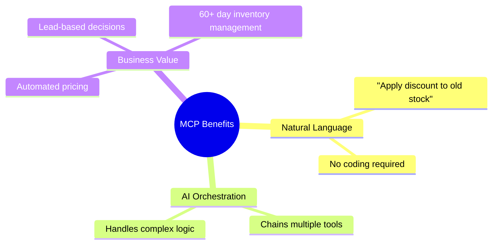

# StockSpark MCP Discount Workflow

## User Story: "Apply 5% discount to all vehicles with 60+ days in stock and no leads"

## Simplified Architecture View

## Step-by-Step Process

## Key Benefits Highlighted

